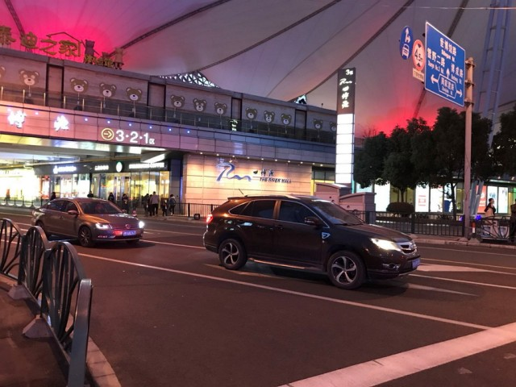
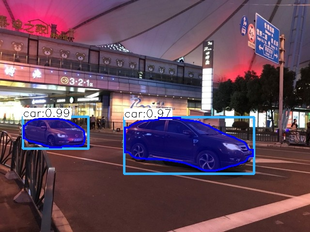
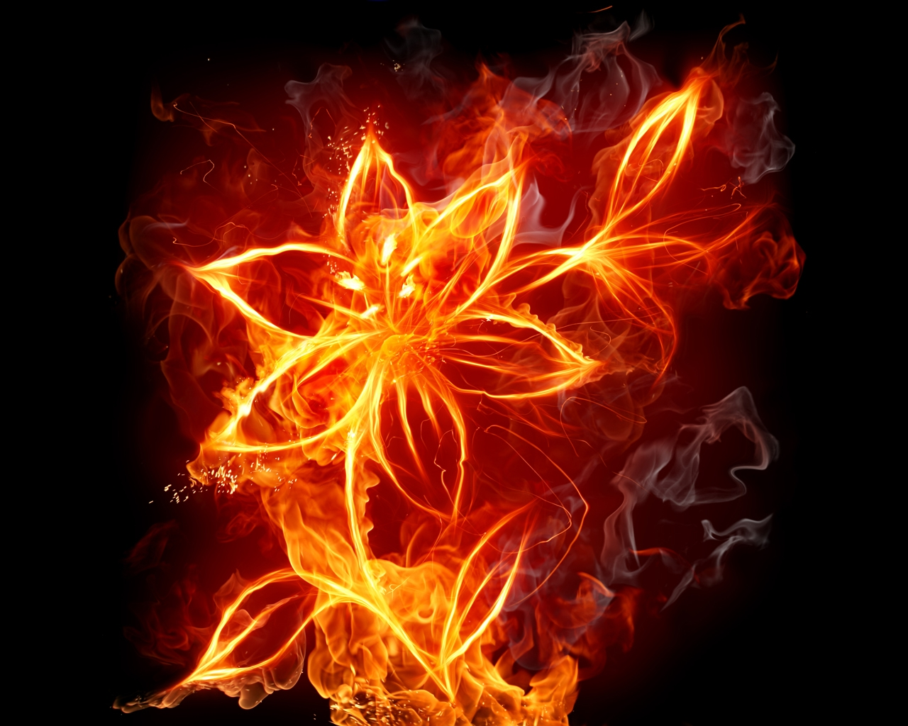
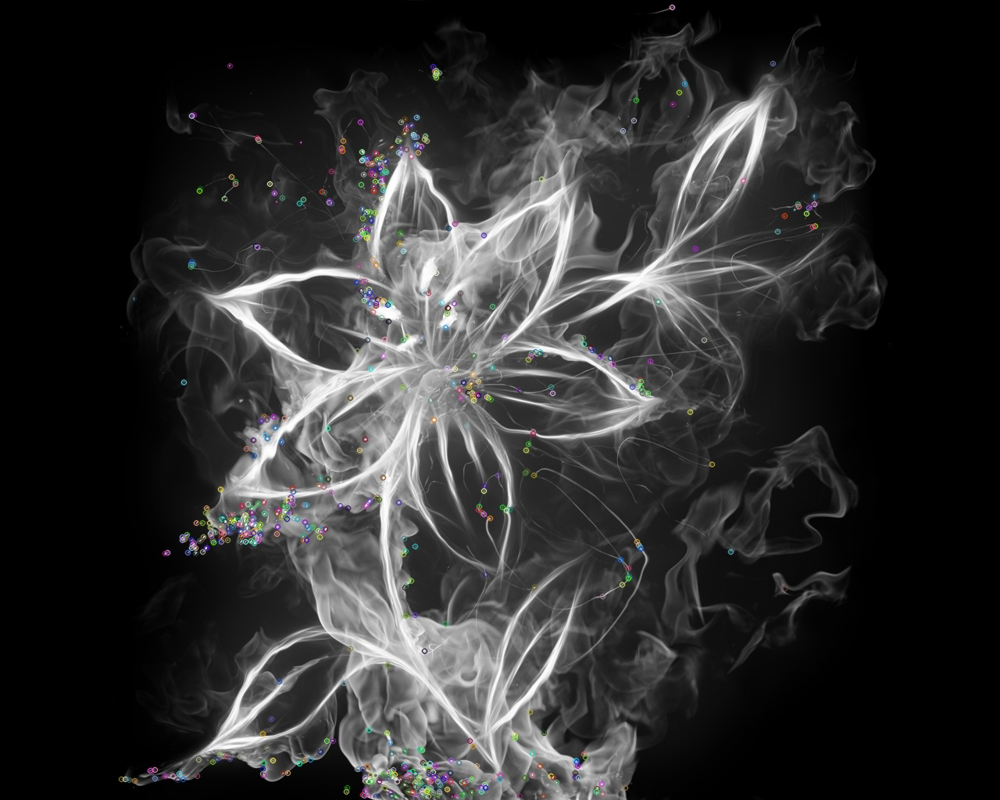
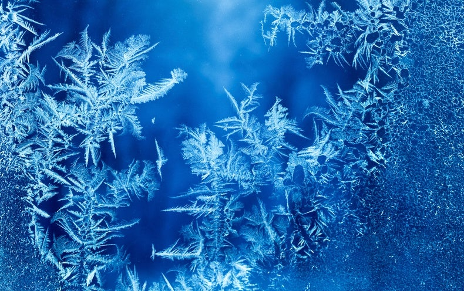
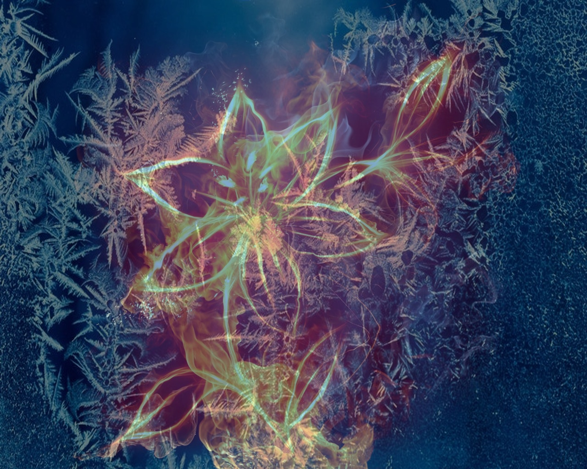

# Computer Vision Demos

This repository contains a few scripts I've written related to computer vision. 

## An Overview of the Scripts

Here is an overview of each script. Note that each script is heavily commented, so should be self explanatory while looking through the code.

### Mask-RCNN (in C++)

This is an implementation of Mask-RCNN object detection being run with OpenCV in C++. This script can be run on either an image or a video. For an image, run `./mask_rcnn_cpp image filename.jpg` and for a video run `./mask_rcnn_cpp video filename.mp4`.

What is really cool about this is that this doesn't need Tensorflow or PyTorch to be installed. Thus, no need for Tensorflow Serving, any Python environments (since it is in C++), or whatever else. Just OpenCV. Also, this is just for inference, this script doesn't do any training of the model. Due to being Mask-RCNN, this model is quite accurate, but unfortunately is still a slow running model. On my laptop being run on a two minute video, it took about five hours. Here's an example input and output image:

Note: The `.pb` and `.pbtxt` files for the model are not included in this repository due to their size, but they are needed to run the script. The `.pb` file can be [found here](http://download.tensorflow.org/models/object_detection/mask_rcnn_inception_v2_coco_2018_01_28.tar.gz) and the `.pbtxt` file can be [found here](https://raw.githubusercontent.com/opencv/opencv_extra/master/testdata/dnn/mask_rcnn_inception_v2_coco_2018_01_28.pbtxt]).

### Feature Detection

This is a demonstration of using the FAST feature detector in OpenCV. Feature detection is the foundation of things like Simultaneous Location and Mapping (SLAM), augmented reality (AR), and many other computer vision technologies. So, I wanted to demonstrate a simple application of it. For an explanation of how the FAST algorithm works, OpenCV has a [great explanation here](https://docs.opencv.org/master/df/d0c/tutorial_py_fast.html).

The detected features are kind of hard to see with the image shrunk on the page, but look for the colorful little dots, those are the detected features.

### Video Red Channel

This is a simple script which demonstrates how to load a video in OpenCV, open a frame as a cv::Mat format, then split the color channels of the frame, remove one of the color channels, then recombine the channels, and recombine the frames to form an output video.

### Blend Image

This is a simple script that just demonstrates how to load an image in OpenCV and overlay another image on it while controlling the alpha transparency.

## How to Run

OpenCV and OpenCV Contrib need to be installed in order to run the C++ scripts. They are compiled using CMake. In each folder there is a CMakeLists.txt file which handles the configuration for the compilation. Each script can be run independently of the others. Just navigate into the folder of the desired script and run `cmake . && make && ./(scipt_name)`.
